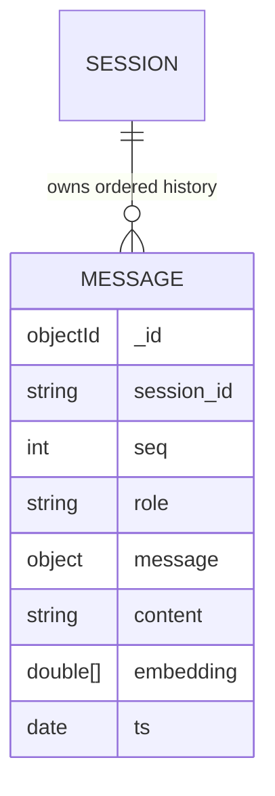

# EDD.md — Entity Document Diagram

The MongoDB data model for `mcp-agent-mongodb`. A single collection, `memory`, backs
`MongoMemory`. Keep this in sync with `src/mcp_agent_mongodb/memory.py`.

## Entities

### `memory` (database `mcp_agent`)

One document per message in an agent's conversation history. Documents are scoped by
`session_id` and ordered by a monotonic `seq` (0-based, contiguous per session).

| Field | Type | Required | Description |
|---|---|---|---|
| `_id` | ObjectId | yes | Primary key (auto) |
| `session_id` | string | yes | Conversation / agent scope key |
| `seq` | int | yes | Monotonic order within the session (insertion order) |
| `role` | string \| null | no | Best-effort role extracted from the message (`user`/`assistant`/…) |
| `message` | object | yes | The serialized message, returned verbatim by `get()` |
| `content` | string \| null | no | Best-effort text for embedding / recall |
| `embedding` | double[1024] | bring-your-own path only | Voyage 3.5 vector |
| `ts` | date | yes | Insert time (UTC); TTL anchor when enabled |

```json
{
  "_id": { "$oid": "…" },
  "session_id": "user-123",
  "seq": 7,
  "role": "user",
  "message": { "role": "user", "parts": [ { "text": "summarize the Q3 report" } ] },
  "content": "summarize the Q3 report",
  "embedding": [0.01, "… 1024 dims …"],
  "ts": { "$date": "2025-01-01T00:00:00Z" }
}
```

## Indexes

- Order index: `{ session_id: 1, seq: 1 }` (`session_seq`) — ordered retrieval + append cursor.
- Optional TTL: `{ ts: 1 }, expireAfterSeconds=ttl_seconds` (`ttl_ts`).
- Atlas Vector Search index `idx_agent_memory` over `embedding`
  (`numDimensions: 1024`, cosine, with a `session_id` filter) — or an `autoEmbed` index
  over `content` when `auto_embed=True` (Atlas Automated Embedding, recall by query text).

## Surface contract → MongoDB ops

| `Memory` method | MongoDB operation |
|---|---|
| `append(message)` | `insert_one` with next `seq` for `session_id` |
| `extend(messages)` | `insert_many` with contiguous `seq` values |
| `set(messages)` | `delete_many({session_id})` then `insert_many` |
| `get()` | `find({session_id}).sort(seq)` → original messages |
| `clear()` | `delete_many({session_id})` |
| `recall_semantic(...)` | `$vectorSearch` over `embedding`, `session_id` prefilter |

## Relationships



## Notes

- `MongoMemory` is a drop-in for mcp-agent's `SimpleMemory` (`llm.history = MongoMemory(...)`).
- `message` stores arbitrary provider message objects (e.g. `google.genai.types.Content`);
  pass `message_model=` to rehydrate them into model instances on `get()`.
- Demo seed data uses the conversation turns created at runtime; the shared
  `data/embeddings.json` corpus is available for larger semantic-recall experiments.
- appName: `devrel-integ-mcp-agent-python`; driver-info: `mcp-agent-mongodb`.
